# Kerala IoT Challenge

> **Foxlab Makerspace** in association with **GTech - Group of Technology Companies in Kerala** is launching our prestigious program  “*Kerala IoT Challenge 2021*”,  with a vision to mould 100 IoT experts in Kerala, hosting on the MuLearn platform. Kerala IoT Challenge is a program designed in 4 levels followed by a hackathon to identify and train quality industry leaders in the IoT domain, while any novice learner can start with layer 1 and others can enter laterally to the desired layer after an evaluation.

### About Me
> Hey y'all,  I'm Anantha Krishnan R J, a first year Electrical & Electronics Engineering Undergraduate from [**College of Engineering, Trivandrum**](https://www.cet.ac.in/). I'm a beginner to the field of IoT. 

## Level 1:

> Level 1 aims to set the foundation to the field of electonics. It comprises of 12 Experiments which are beginner friendly.

## Experiments 
---

### Experiment 1 - Hello World LED Blinking

> A basic Program similar to printing "*Hello World* " in any programming language. The Aim is to blink an LED using **Arduino Uno Board**.

>Arduino Uno is an open-source microcontroller board developed by Arduino.cc. It has several advantages over the conventional microcontrollers. It comes with a pre-tested software and hardware libraries and has its own integrated development environment (IDE). Also it is less expensive & beginner friendly.

#### Components Required
   * Arduino Uno Board x1
   * USB Cable x1
   * LED (Any Color) x1
   * 220 OHM Resistor X1
   * Breadboard
   * Jumper Wires (Male to Male ) x2

#### Code

```

int ledPin = 10; // define digital pin 10.

void setup()
{
    pinMode(ledPin, OUTPUT);// define pin with  LED connected as output.
}
void loop()
{
    digitalWrite(ledPin, HIGH); // set the LED on.
    delay(1000); // wait for a second.
    digitalWrite(ledPin, LOW); // set the LED off.
    delay(1000); // wait for a second
} 

```

#### Circuit Diagram

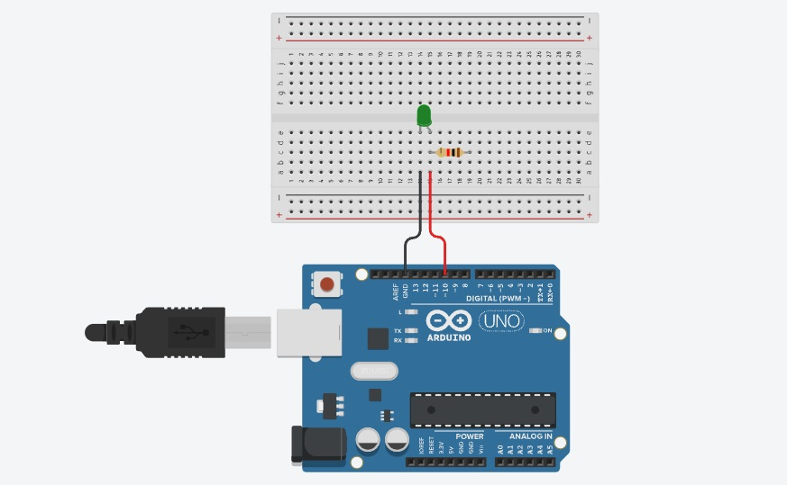

#### Simulation 

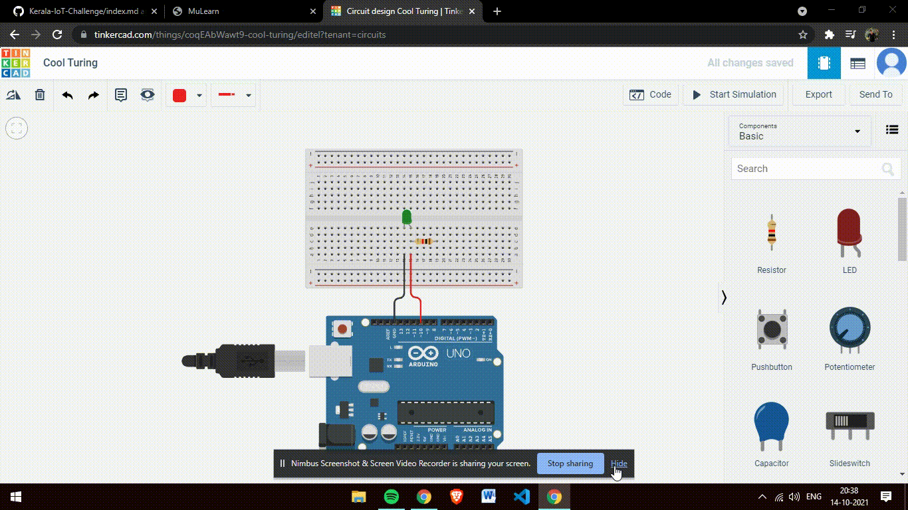

#### Snapshot

<iframe width="560" height="315" src="https://www.youtube.com/embed/lnA6eKeujNo" title="YouTube video player" frameborder="0" allow="accelerometer; autoplay; clipboard-write; encrypted-media; gyroscope; picture-in-picture" allowfullscreen></iframe>

### Experiment 2 - Traffic Light

> Similar experiment to that of the previous one. Instead of 1 LED, 3 LEDs are used.

#### Components Required
  * Arduino board x1
  * USB cable x1
  * Red M5 LED x1
  * Yellow M5 LED x1
  * Green M5 LED x1
  * 220Ω resistor x3
  * Breadboard x1
  * Breadboard jumper wires as required.

#### Code

```

int redled =13; // initialize digital pin 13.
int yellowled =9; // initialize digital pin 9.
int greenled =6; // initialize digital pin 6.
void setup()
{
    pinMode(redled, OUTPUT);// set the pin with red LED as “output”
    pinMode(yellowled, OUTPUT); // set the pin with yellow LED as “output”
    pinMode(greenled, OUTPUT); // set the pin with green LED as “output”
}
void loop()
{
    digitalWrite(greenled, HIGH);//// turn on green LED
    delay(5000);// wait 5 seconds

    digitalWrite(greenled, LOW); // turn off green LED

    for(int i=0;i<3;i++)// blinks for 3 times
    {
         delay(500);// wait 0.5 second
         digitalWrite(yellowled, HIGH);// turn on yellow LED
         delay(500);// wait 0.5 second
         digitalWrite(yellowled, LOW);// turn off yellow LED
    } 
    delay(500);// wait 0.5 second
    digitalWrite(redled, HIGH);// turn on red LED
    delay(5000);// wait 5 seconds
    digitalWrite(redled, LOW);// turn off red LED
}

```
#### Circuit Diagram

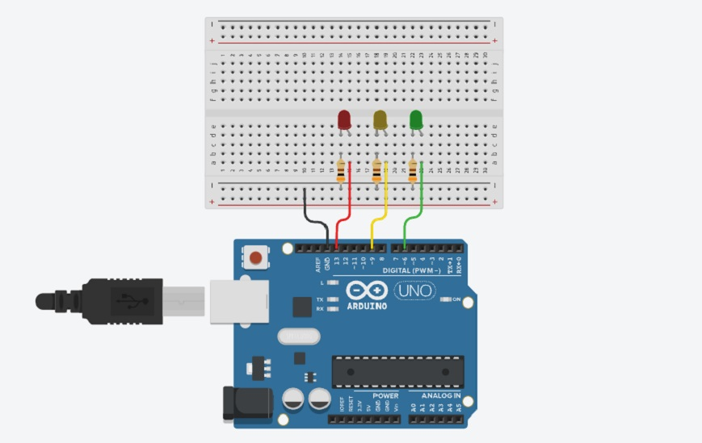

#### Simulation


## Experiment 3 - LED Chasing Effect

> We often see billboards composed of colorful LEDs. They are constantly changing to form various light effects. In this experiment, we compile a program to simulate LED chasing effect.

### Components Required
 * Led *6
 * Arduino board *1
 * 220Ω resistor *6
 * Breadboard *1
 * USB cable*1
 * Breadboard wire *13

### Code

```

int BASE = 1;  // the I/O pin for the first LED
int NUM = 6;   // number of LEDs
void setup()
{
   for (int i = BASE; i <=BASE + NUM; i ++) 
   {
     pinMode(i, OUTPUT);   // set I/O pins as output
   }
}
void loop()
{
   for (int i = BASE; i <=BASE + NUM; i ++) 
   {
     digitalWrite(i, LOW);    // set I/O pins as “low”, turn off LEDs one by one.
     delay(200);        // delay
   }
   for (int i = BASE; i <=BASE + NUM; i ++) 
   {
     digitalWrite(i, HIGH);    // set I/O pins as “high”, turn on LEDs one by one
     delay(200);        // delay
   }  
}

```
### Circuit Diagram

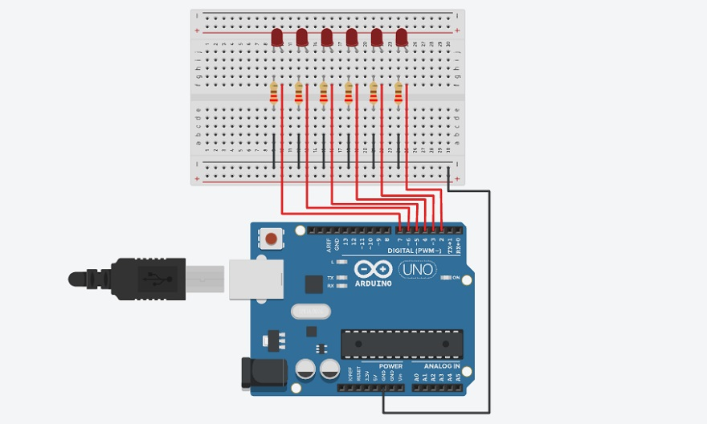

### Simulation 


## Experiment 4 - Button Controlled LED

> An experiment to light an LED using a Push Button.

### Components Required
 * Led *6
 * Arduino board *1
 * 220Ω resistor *6
 * Breadboard *1
 * USB cable*1
 * Breadboard wire *13

### Code

```

int ledpin=9;// initialize pin 9
int inpin=6;// initialize pin 6
int val;// define val
void setup()
{
    pinMode(ledpin,OUTPUT);// set LED pin as “output”
    pinMode(inpin,INPUT);// set button pin as “input”
}
void loop()
{
    val=digitalRead(inpin);// read the level value of pin 7 and assign if to val
    if(val==LOW)// check if the button is pressed, if yes, turn on the LED
    { 
        digitalWrite(ledpin,LOW);
    }
    else
    { 
        digitalWrite(ledpin,HIGH);}
    }
}

```
### Circuit Diagram

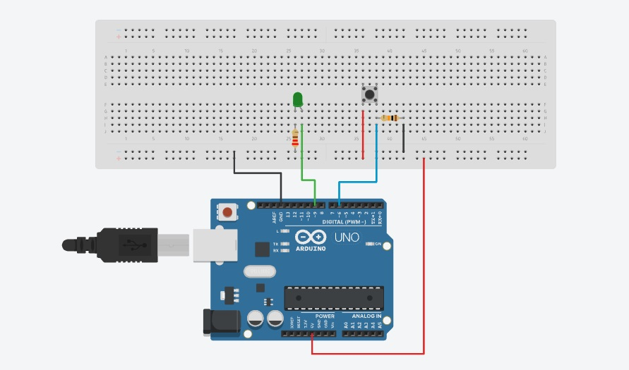

### Simulation 

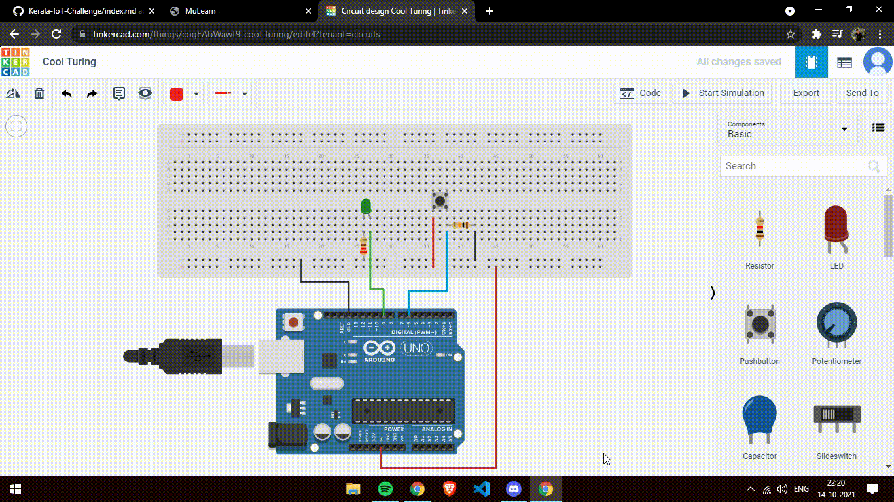

## Experiment 5 - Buzzer

> An experiment to understand the working of a buzzer.

### Components Required
  * Arduino Uno
  * Buzzer x1
  * Breadboard x1
  * Breadboard Jumper Wire x2
  * USB cable x1

### Code

```

int buzzer=8;// initialize digital IO pin that controls the buzzer
void setup() 
{ 
  pinMode(buzzer,OUTPUT);// set pin mode as “output”
} 
void loop() 
{
digitalWrite(buzzer, HIGH); // produce sound
}

```
### Circuit Diagram

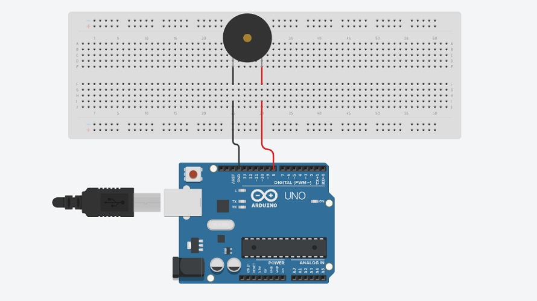

### Simulation 

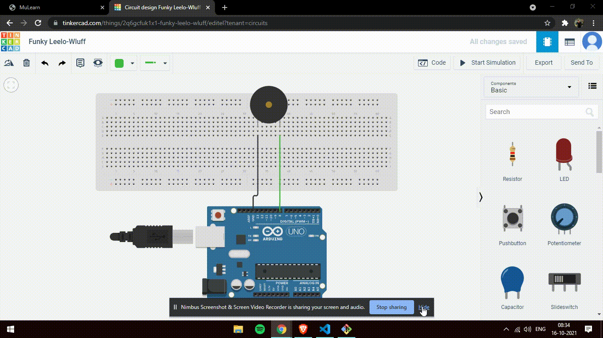

## Experiment 6 - RGB LED

> An experiment to understand the working of a RGB LED.

### Components Required
  * Arduino Uno
  * USB Cable x1
  * RGB LED x1
  * Resistor x3
  * Breadboard jumper wire x5

### Code

```

int redpin = 11; //select the pin for the red LED
int bluepin =10; // select the pin for the blue LED
int greenpin =9;// select the pin for the green LED
int val;
void setup() {
  pinMode(redpin, OUTPUT);
  pinMode(bluepin, OUTPUT);
  pinMode(greenpin, OUTPUT);
  Serial.begin(9600);
}
void loop() 
{
for(val=255; val>0; val--)
  {
   analogWrite(11, val);
   analogWrite(10, 255-val);
   analogWrite(9, 128-val);
   delay(1); 
  }
for(val=0; val<255; val++)
  {
   analogWrite(11, val);
   analogWrite(10, 255-val);
   analogWrite(9, 128-val);
   delay(1); 
  }
 Serial.println(val, DEC);
}

```
### Circuit Diagram

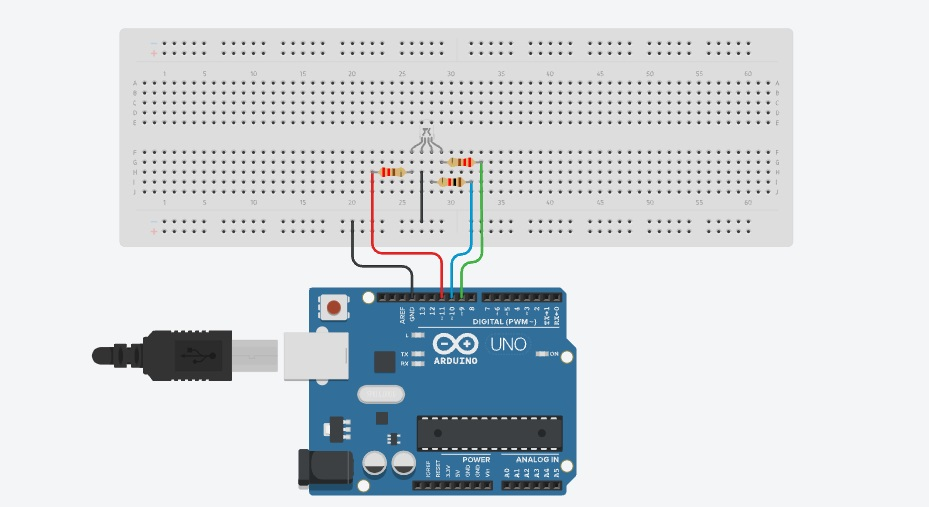

### Simulation

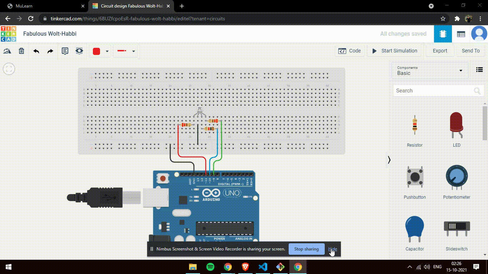

## Experiment 7 - LDR Light Sensor

> An experiment to understand the working of an LDR light Sensor.

> LDR : Light Dependent Sensor is a resistor whose resistance varies from different incident light strength. It is based on the photoelectric effect of the semiconductor. If the incident light is intense, its resistance reduces; if the incident light is weak, the resistance increases.

### Components Required
  * Arduino Uno Board
  * Photo Resistor*1
  * Red M5 LED*1
  * 10KΩ Resistor*1
  * 220Ω Resistor*1
  * Breadboard*1
  * Breadboard Jumper Wire*5
  * USB cable*1

### Code

```

int potpin=0;// initialize analog pin 0, connected with photovaristor
int ledpin=11;// initialize digital pin 11, 
int val=0;// initialize variable val
void setup()
{
  pinMode(ledpin,OUTPUT);// set digital pin 11 as “output”
  Serial.begin(9600);// set baud rate at “9600”
}
void loop()
{
  val=analogRead(potpin);// read the value of the sensor and assign it to val
  Serial.println(val);// display the value of val
  analogWrite(ledpin,val/4);// set up brightness（maximum value 255）
  delay(10);// wait for 0.01 
}
```
### Circuit Diagram

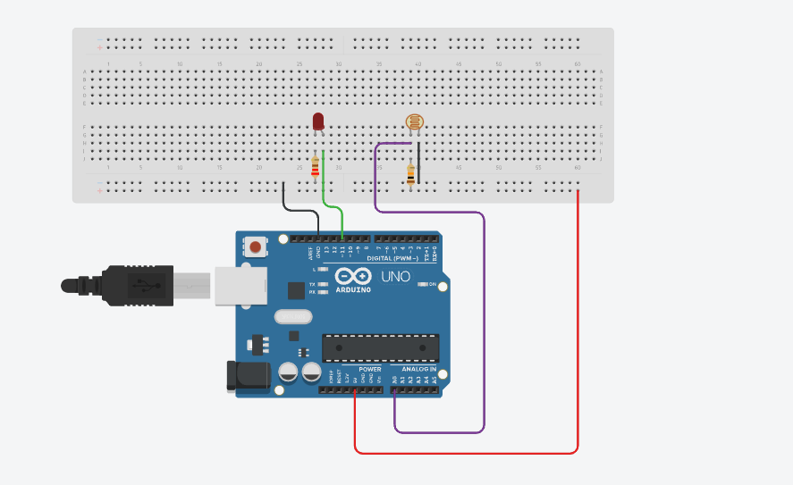

### Simulation


## Experiment 8  - Flame Sensor

> Infrared Receiver (IR) is used for detecting flame.

### Components Required
* Arduino Uno Board*1
* Flame Sensor *1
* Buzzer *1
* 10K Resistor *1
* Breadboard Jumper Wire*6
* USB cable*1

### Code

```

int flame=0;// select analog pin 0 for the sensor
int Beep=9;// select digital pin 9 for the buzzer
int val=0;// initialize variable
 void setup() 
{
  pinMode(Beep,OUTPUT);// set LED pin as “output”
 pinMode(flame,INPUT);// set buzzer pin as “input”
 Serial.begin(9600);// set baud rate at “9600”
 } 
void loop() 
{ 
  val=analogRead(flame);// read the analog value of the sensor 
  Serial.println(val);// output and display the analog value
  if(val>=600)// when the analog value is larger than 600, the buzzer will buzz
  {  
   digitalWrite(Beep,HIGH); 
   }else 
   {  
     digitalWrite(Beep,LOW); 
    }
   delay(500); 
}
```
### Circuit Diagram

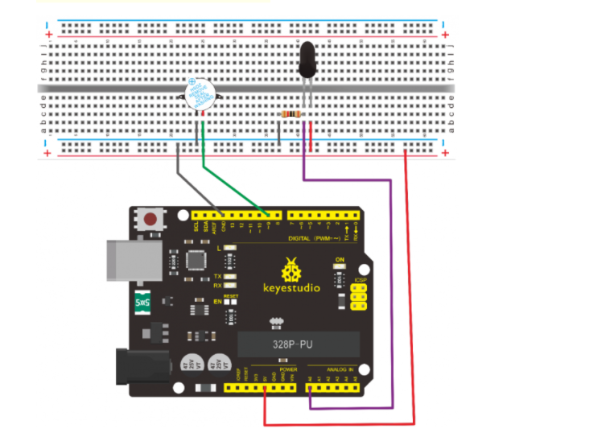

### Snapshots

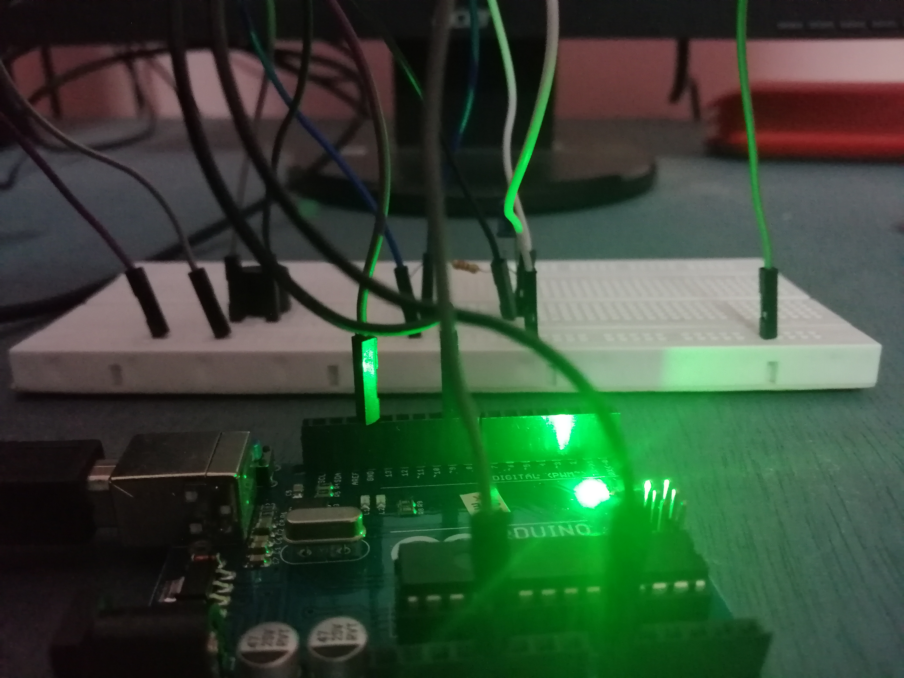

## Experiment 9   - LM35 Temperature Sensor

> LM35 is a widely used temperature sensor with many different package types.
LM35 temperature sensor can produce different voltage by different temperature
When temperature is 0 ℃, it outputs 0V;

### Components Required
* Arduino Uno  Board *1
* LM35 *1
* Breadboard *1
* Breadboard Jumper Wire *5
* USB cable *1

### Code

```

int potPin = 0; // initialize analog pin 0 for LM35 temperature sensor
void setup()
{
Serial.begin(9600);// set baud rate at”9600”
}
void loop()
{
int val;// define variable
int dat;// define variable
val=analogRead(0);// read the analog value of the sensor and assign it to val
dat=(125*val)>>8;// temperature calculation formula
Serial.print("Tep");// output and display characters beginning with Tep
Serial.print(dat);// output and display value of dat
Serial.println("C");// display “C” characters
delay(500);// wait for 0.5 second
}
```
### Circuit Diagram

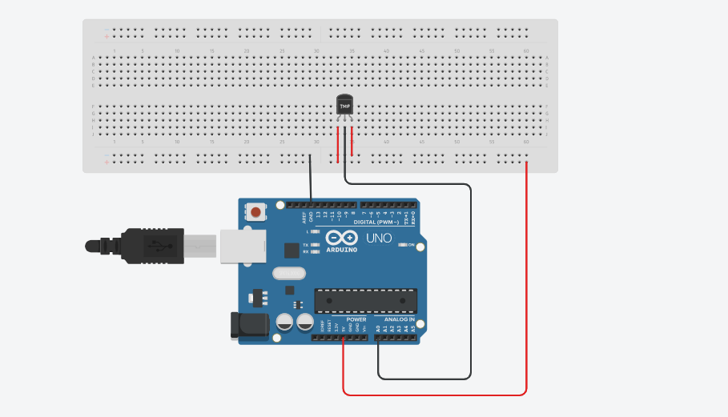

### Snapshots


<iframe width="560" height="315" src="https://www.youtube.com/embed/xWZ7433ePM0" title="YouTube video player" frameborder="0" allow="accelerometer; autoplay; clipboard-write; encrypted-media; gyroscope; picture-in-picture" allowfullscreen></iframe>

## Experiment 10   - IR Remote Control Using TSOP

> An infrared receiver, or IR receiver, is hardware that sends information from an infrared remote control to another device by receiving and decoding signals. This is being used in most of the remotes we use at home.

### Components Required
* Arduino Uno Board *1
* Infrared Remote Controller(You can use TV Remote or any other remote) *1
* Infrared Receiver *1
* LED *6
* 220ΩResistor *6
* Breadboard Wire *11
* USB cable *1

### Code

```

########
```
### Circuit Diagram

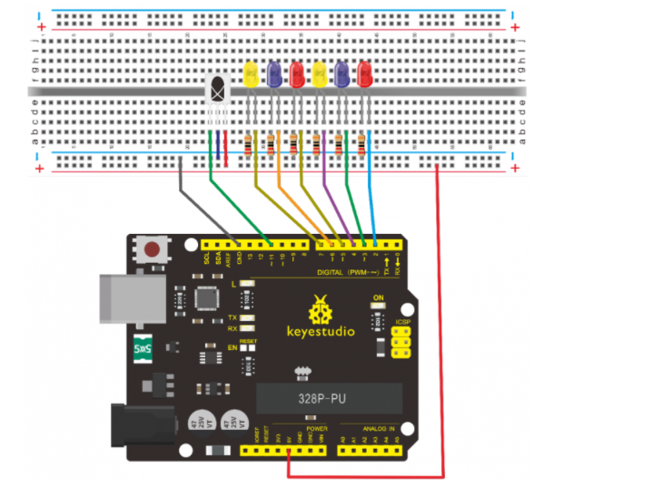

### Snapshots

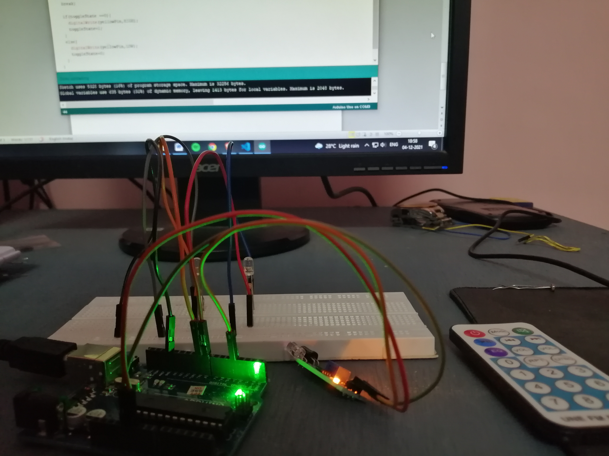


## Experiment 11   - Potentiometer analog Value Reading


> Potentiometer is a type of variable resistor, Whose value can be changed by turing the screw at the top.

### Components Required
* Arduino Uno Board *1
* 10K Potentiometer *1
* Breadboard *1
* Breadboard Jumper Wire *3
* USB cable *1

### Code

```

int potpin=0;// initialize analog pin 0
int ledpin=13;// initialize digital pin 13
int val=0;// define val, assign initial value 0
void setup()
{
pinMode(ledpin,OUTPUT);// set digital pin as “output”
Serial.begin(9600);// set baud rate at 9600
}
void loop()
{
digitalWrite(ledpin,HIGH);// turn on the LED on pin 13
delay(50);// wait for 0.05 second
digitalWrite(ledpin,LOW);// turn off the LED on pin 13
delay(50);// wait for 0.05 second
val=analogRead(potpin);// read the analog value of analog pin 0, and assign it to val 
Serial.println(val);// display val’s value
}

```
### Circuit Diagram

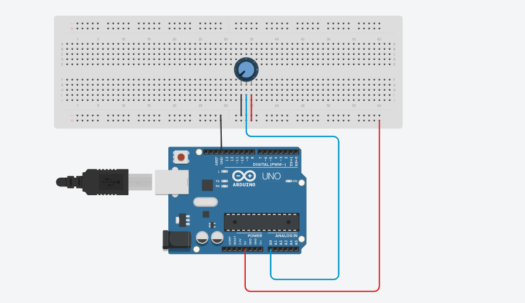

### Snapshots


## Experiment 12   - 7 Segment Display


> LED segment display is a semiconductor light-emitting device. Its basic unit is a light-emitting diode (LED). LED segment display can be divided into 7-segment display and 8-segment display according to the number of segments. 8-segment display has one more LED unit ( for decimal point display) than 7-segment one.

### Components Required
* Arduino Uno Board *1
* 1 -digit LED Segment Display *1
* 220Ω Resistor *8
* Breadboard *1
* Breadboard Jumper Wires (As per the requirement)
* USB cable *1

### Code

```

int a=7;// set digital pin 7 for segment a
int b=6;// set digital pin 6 for segment b
int c=5;// set digital pin 5 for segment c
int d=10;// set digital pin 10 for segment d
int e=11;// set digital pin 11 for segment e
int f=8;// set digital pin 8 for segment f
int g=9;// set digital pin 9 for segment g
int dp=4;// set digital pin 4 for segment dp
void digital_0(void) // display number 5
{
unsigned char j;
digitalWrite(a,HIGH);
digitalWrite(b,HIGH);
digitalWrite(c,HIGH);
digitalWrite(d,HIGH);
digitalWrite(e,HIGH);
digitalWrite(f,HIGH);
digitalWrite(g,LOW);
digitalWrite(dp,LOW);
}
void digital_1(void) // display number 1
{
unsigned char j;
digitalWrite(c,HIGH);// set level as “high” for pin 5, turn on segment c
digitalWrite(b,HIGH);// turn on segment b
for(j=7;j<=11;j++)// turn off other segments
digitalWrite(j,LOW);
digitalWrite(dp,LOW);// turn off segment dp
}
void digital_2(void) // display number 2
{
unsigned char j;
digitalWrite(b,HIGH);
digitalWrite(a,HIGH);
for(j=9;j<=11;j++)
digitalWrite(j,HIGH);
digitalWrite(dp,LOW);
digitalWrite(c,LOW);
digitalWrite(f,LOW);
}
void digital_3(void) // display number 3
{digitalWrite(g,HIGH);
digitalWrite(a,HIGH);
digitalWrite(b,HIGH);
digitalWrite(c,HIGH);
digitalWrite(d,HIGH);
digitalWrite(dp,LOW);
digitalWrite(f,LOW);
digitalWrite(e,LOW);
}
void digital_4(void) // display number 4
{digitalWrite(c,HIGH);
digitalWrite(b,HIGH);
digitalWrite(f,HIGH);
digitalWrite(g,HIGH);
digitalWrite(dp,LOW);
digitalWrite(a,LOW);
digitalWrite(e,LOW);
digitalWrite(d,LOW);
}
void digital_5(void) // display number 5
{
unsigned char j;
digitalWrite(a,HIGH);
digitalWrite(b, LOW);
digitalWrite(c,HIGH);
digitalWrite(d,HIGH);
digitalWrite(e, LOW);
digitalWrite(f,HIGH);
digitalWrite(g,HIGH);
digitalWrite(dp,LOW);
}
void digital_6(void) // display number 6
{
unsigned char j;
for(j=7;j<=11;j++)
digitalWrite(j,HIGH);
digitalWrite(c,HIGH);
digitalWrite(dp,LOW);
digitalWrite(b,LOW);
}
void digital_7(void) // display number 7
{
unsigned char j;
for(j=5;j<=7;j++)
digitalWrite(j,HIGH);
digitalWrite(dp,LOW);
for(j=8;j<=11;j++)
digitalWrite(j,LOW);
}
void digital_8(void) // display number 8
{
unsigned char j;
for(j=5;j<=11;j++)
digitalWrite(j,HIGH);
digitalWrite(dp,LOW);
}
void digital_9(void) // display number 5
{
unsigned char j;
digitalWrite(a,HIGH);
digitalWrite(b,HIGH);
digitalWrite(c,HIGH);
digitalWrite(d,HIGH);
digitalWrite(e, LOW);
digitalWrite(f,HIGH);
digitalWrite(g,HIGH);
digitalWrite(dp,LOW);
}
void setup()
{
int i;// set variable
for(i=4;i<=11;i++)
pinMode(i,OUTPUT);// set pin 4-11as “output”
}
void loop()
{
while(1)
{
digital_0();// display number 0
delay(1000);// wait for 1s
digital_1();// display number 1
delay(1000);// wait for 1s
digital_2();// display number 2
delay(1000); // wait for 1s
digital_3();// display number 3
delay(1000); // wait for 1s
digital_4();// display number 4
delay(1000); // wait for 1s
digital_5();// display number 5
delay(1000); // wait for 1s
digital_6();// display number 6
delay(1000); // wait for 1s
digital_7();// display number 7
delay(1000); // wait for 1s
digital_8();// display number 8
delay(1000); // wait for 1s
digital_9();// display number 9
delay(1000); // wait for 1s
}}

```
### Circuit Diagram

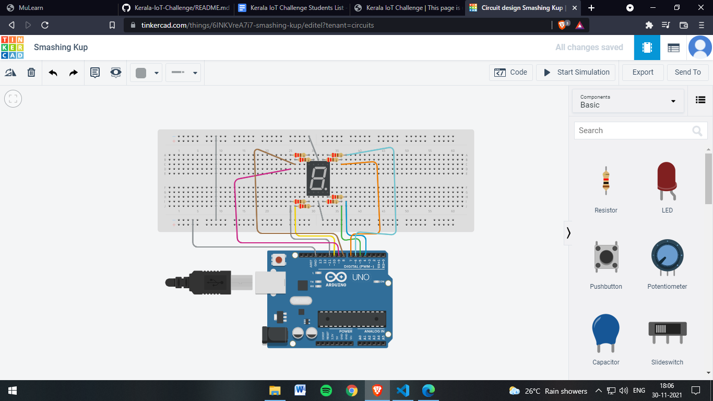

### Snapshots


## Assignment 1 - Automatic night lamp using LDR & LED

### Components Required
* Arduino Uno Board *1
* 10kΩ Resistor *1
* Breadboard *1
* Breadboard Jumper Wire (As per requirement)
* USB cable *1
* 220Ω Resistor
* LDR(Photoresistor)

### Code

```

void setup() {
  Serial.begin(9600);
  pinMode(13,OUTPUT);
}
void loop() {
  float Value = analogRead(A0);
  // Reads the analog input ranging from 0 to 1023
  Serial.println(Value);
  if(Value<=570)
  {
    digitalWrite(13,HIGH);
  }
  else
  digitalWrite(13,LOW);
}


```

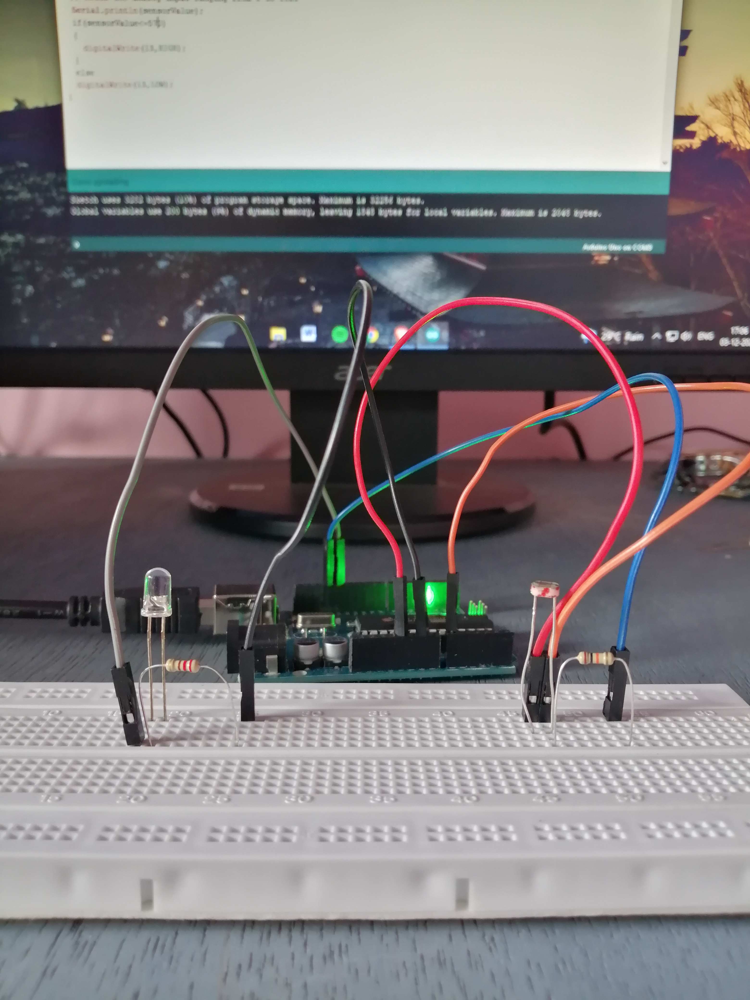

## Simulation

<iframe width="650" height="345" src="https://www.youtube.com/embed/YnOgSGl-LDE" title="YouTube video player" frameborder="0" allow="accelerometer; autoplay; clipboard-write; encrypted-media; gyroscope; picture-in-picture" allowfullscreen></iframe>

## Assignment 2 - Digital Dice using LEDs & Push Button.

### Components Required
* Arduino Uno Board *1
* 10kΩ Resistor *1
* Breadboard *1
* Breadboard Jumper Wire (As per requirement)
* USB cable *1
* 220Ω Resistor *6
* LED *6
* PushButton

### Code

```

int led1 = 2;
int led2 = 3;
int led3 = 4;
int led4 = 5;
int led5 = 6;
int led6 = 7;
int button = 11;
int pressed = 0;

void setup() {
  for (int i=led1; i<=led6; i++) 
    pinMode(i, OUTPUT);
  pinMode(button, INPUT);
  Serial.begin(9600);

}

void showNumber(int x) {
  if (x >= 1) 
    digitalWrite(led1, HIGH);
  
  if (x >= 2) 
    digitalWrite(led2, HIGH);
  
  if (x >= 3) 
    digitalWrite(led3, HIGH);    
  
  if (x >= 4) 
    digitalWrite(led4, HIGH);    
 
  if (x >= 5) 
    digitalWrite(led5, HIGH);    
  
  if (x == 6) 
    digitalWrite(led6, HIGH);    
  
}

int throwDice() {
  int randomnum = random(1,7);
  return randomnum;
}

void setAllLED(int value) {
  for (int i=led1; i<=led6; i++) {
    digitalWrite(i, value);
  }
}

void loop() {
  pressed = digitalRead(button);

  if (pressed == HIGH) {
    setAllLED(LOW);   
   int thrownNumber = throwDice();
   showNumber(thrownNumber);
  } 

}

```

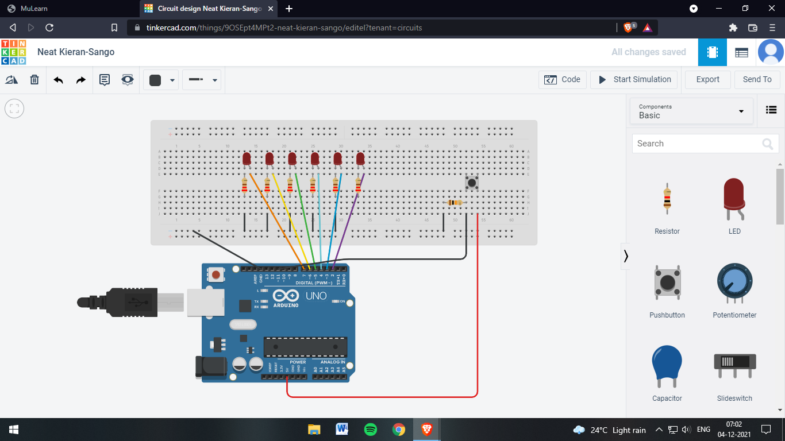

## Simulation

<iframe width="560" height="315" src="https://www.youtube.com/embed/CpxH_lghoPY" title="YouTube video player" frameborder="0" allow="accelerometer; autoplay; clipboard-write; encrypted-media; gyroscope; picture-in-picture" allowfullscreen></iframe>