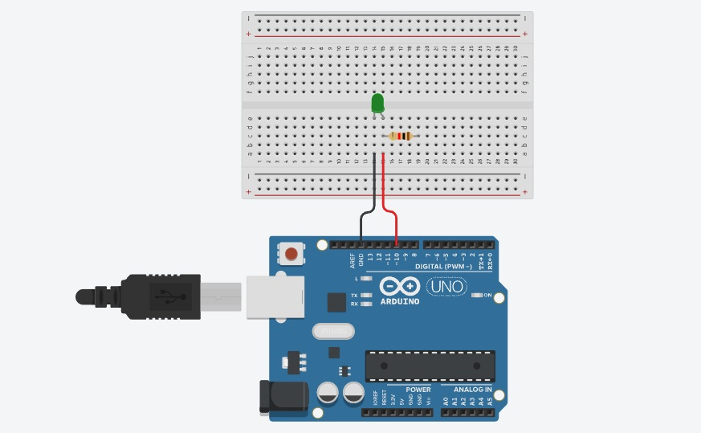
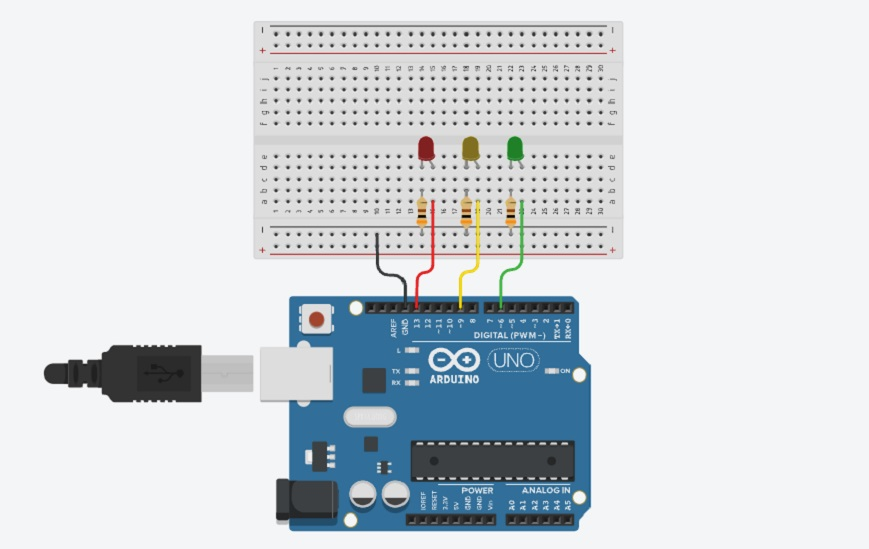
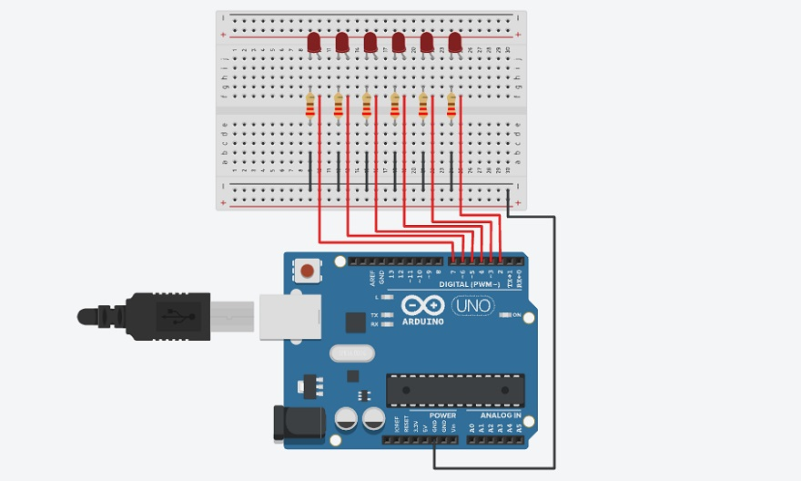
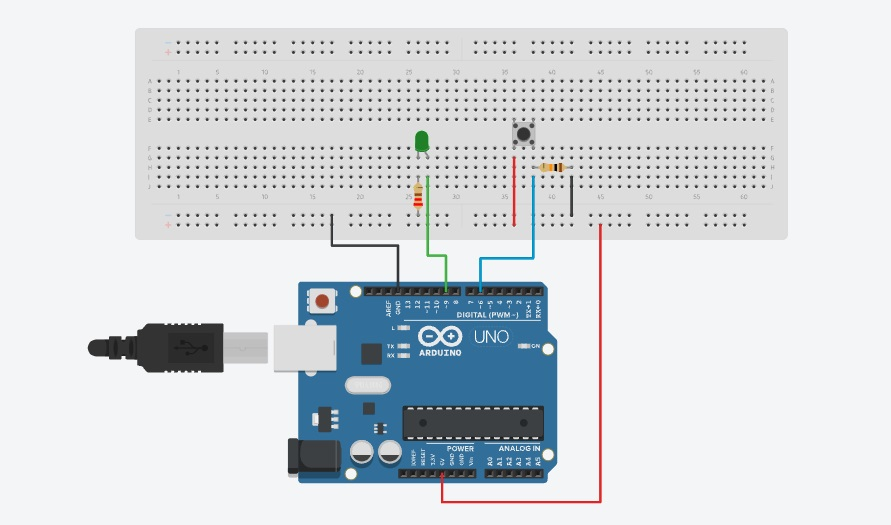
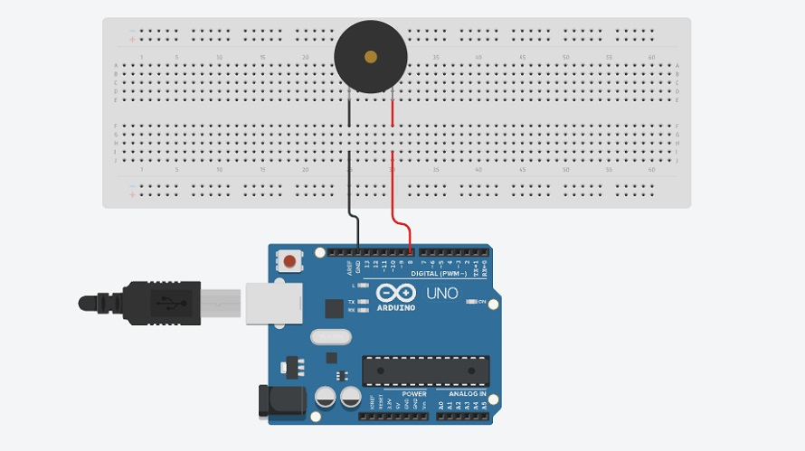
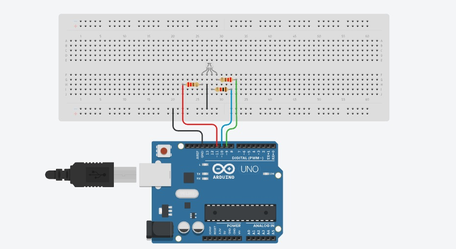

# Kerala IoT Challenge

> **Foxlab Makerspace** in association with **GTech - Group of Technology Companies in Kerala** is launching our prestigious program  “*Kerala IoT Challenge 2021*”,  with a vision to mould 100 IoT experts in Kerala, hosting on the MuLearn platform. Kerala IoT Challenge is a program designed in 4 levels followed by a hackathon to identify and train quality industry leaders in the IoT domain, while any novice learner can start with layer 1 and others can enter laterally to the desired layer after an evaluation.

### About Me
> Hey y'all,  I'm Anantha Krishnan R J, a first year Electrical & Electronics Engineering Undergraduate from [**College of Engineering, Trivandrum**](https://www.cet.ac.in/). A beginner to the field of IoT. Hope it goes well.

## Level 1:

> Level 1 aims to set the foundation to the field of electonics. It comprises of 12 Experiments which are beginner friendly.

## Experiments 
---

### Experiment 1 - Hello World LED Blinking

> A basic Program similar to printing "*Hello World* " in any programming language. The Aim is to blink an LED using **Arduino Uno Board**.

>Arduino Uno is an open-source microcontroller board developed by Arduino.cc. It has several advantages over the conventional microcontrollers. It comes with a pre-tested software and hardware libraries and has its own integrated development environment (IDE). Also it is less expensive & beginner friendly.

#### Components Required
   * Arduino Uno Board x1
   * USB Cable x1
   * LED (Any Color) x1
   * 220 OHM Resistor X1
   * Breadboard
   * Jumper Wires (Male to Male ) x2

#### Code

```

int ledPin = 10; // define digital pin 10.

void setup()
{
    pinMode(ledPin, OUTPUT);// define pin with  LED connected as output.
}
void loop()
{
    digitalWrite(ledPin, HIGH); // set the LED on.
    delay(1000); // wait for a second.
    digitalWrite(ledPin, LOW); // set the LED off.
    delay(1000); // wait for a second
} 

```

#### Circuit Diagram



#### Simulation 

<iframe width="650" height="335" src="https://www.youtube.com/embed/1ex6jYmz-p8" title="exp1" frameborder="0" allow="accelerometer; autoplay; clipboard-write; encrypted-media; gyroscope; picture-in-picture" allowfullscreen></iframe>

### Experiment 2 - Traffic Light

> Similar experiment to that of the previous one. Instead of 1 LED, 3 LEDs are used.

#### Components Required
  * Arduino board x1
  * USB cable x1
  * Red M5 LED x1
  * Yellow M5 LED x1
  * Green M5 LED x1
  * 220Ω resistor x3
  * Breadboard x1
  * Breadboard jumper wires as required.

#### Code

```

int redled =13; // initialize digital pin 13.
int yellowled =9; // initialize digital pin 9.
int greenled =6; // initialize digital pin 6.
void setup()
{
    pinMode(redled, OUTPUT);// set the pin with red LED as “output”
    pinMode(yellowled, OUTPUT); // set the pin with yellow LED as “output”
    pinMode(greenled, OUTPUT); // set the pin with green LED as “output”
}
void loop()
{
    digitalWrite(greenled, HIGH);//// turn on green LED
    delay(5000);// wait 5 seconds

    digitalWrite(greenled, LOW); // turn off green LED

    for(int i=0;i<3;i++)// blinks for 3 times
    {
         delay(500);// wait 0.5 second
         digitalWrite(yellowled, HIGH);// turn on yellow LED
         delay(500);// wait 0.5 second
         digitalWrite(yellowled, LOW);// turn off yellow LED
    } 
    delay(500);// wait 0.5 second
    digitalWrite(redled, HIGH);// turn on red LED
    delay(5000);// wait 5 seconds
    digitalWrite(redled, LOW);// turn off red LED
}

```
#### Circuit Diagram



#### Simulation

<iframe width="650" height="335" src="https://www.youtube.com/embed/eb3MCQJ6O7s" title="YouTube video player" frameborder="0" allow="accelerometer; autoplay; clipboard-write; encrypted-media; gyroscope; picture-in-picture" allowfullscreen></iframe>

## Experiment 3 - LED Chasing Effect

> We often see billboards composed of colorful LEDs. They are constantly changing to form various light effects. In this experiment, we compile a program to simulate LED chasing effect.

### Components Required
 * Led *6
 * Arduino board *1
 * 220Ω resistor *6
 * Breadboard *1
 * USB cable*1
 * Breadboard wire *13

### Code

```

int BASE = 1;  // the I/O pin for the first LED
int NUM = 6;   // number of LEDs
void setup()
{
   for (int i = BASE; i <=BASE + NUM; i ++) 
   {
     pinMode(i, OUTPUT);   // set I/O pins as output
   }
}
void loop()
{
   for (int i = BASE; i <=BASE + NUM; i ++) 
   {
     digitalWrite(i, LOW);    // set I/O pins as “low”, turn off LEDs one by one.
     delay(200);        // delay
   }
   for (int i = BASE; i <=BASE + NUM; i ++) 
   {
     digitalWrite(i, HIGH);    // set I/O pins as “high”, turn on LEDs one by one
     delay(200);        // delay
   }  
}

```
### Circuit Diagram



### Simulation 

<iframe width="650" height="335" src="https://www.youtube.com/embed/cR959Dh0Emw" title="YouTube video player" frameborder="0" allow="accelerometer; autoplay; clipboard-write; encrypted-media; gyroscope; picture-in-picture" allowfullscreen></iframe>

## Experiment 4 - Button Controlled LED

> An experiment to light an LED using a Push Button.

### Components Required
 * Led *6
 * Arduino board *1
 * 220Ω resistor *6
 * Breadboard *1
 * USB cable*1
 * Breadboard wire *13

### Code

```

int ledpin=9;// initialize pin 9
int inpin=6;// initialize pin 6
int val;// define val
void setup()
{
    pinMode(ledpin,OUTPUT);// set LED pin as “output”
    pinMode(inpin,INPUT);// set button pin as “input”
}
void loop()
{
    val=digitalRead(inpin);// read the level value of pin 7 and assign if to val
    if(val==LOW)// check if the button is pressed, if yes, turn on the LED
    { 
        digitalWrite(ledpin,LOW);
    }
    else
    { 
        digitalWrite(ledpin,HIGH);}
    }
}

```
### Circuit Diagram



### Simulation 

<iframe width="650" height="335" src="https://www.youtube.com/embed/NAz4HatpXPA" title="YouTube video player" frameborder="0" allow="accelerometer; autoplay; clipboard-write; encrypted-media; gyroscope; picture-in-picture" allowfullscreen></iframe>

## Experiment 5 - Buzzer

> An experiment to understand the working of a buzzer.

### Components Required
  * Arduino Uno
  * Buzzer x1
  * Breadboard x1
  * Breadboard Jumper Wire x2
  * USB cable x1

### Code

```

int buzzer=8;// initialize digital IO pin that controls the buzzer
void setup() 
{ 
  pinMode(buzzer,OUTPUT);// set pin mode as “output”
} 
void loop() 
{
digitalWrite(buzzer, HIGH); // produce sound
}

```
### Circuit Diagram



### Simulation 

<iframe width="650" height="335" src="https://www.youtube.com/embed/VPA7fnJSf70" title="YouTube video player" frameborder="0" allow="accelerometer; autoplay; clipboard-write; encrypted-media; gyroscope; picture-in-picture" allowfullscreen></iframe>

## Experiment 6 - RGB LED

> An experiment to understand the working of a RGB LED.

### Components Required
  * Arduino Uno
  * USB Cable x1
  * RGB LED x1
  * Resistor x3
  * Breadboard jumper wire x5

### Code

```

int redpin = 11; //select the pin for the red LED
int bluepin =10; // select the pin for the blue LED
int greenpin =9;// select the pin for the green LED
int val;
void setup() {
  pinMode(redpin, OUTPUT);
  pinMode(bluepin, OUTPUT);
  pinMode(greenpin, OUTPUT);
  Serial.begin(9600);
}
void loop() 
{
for(val=255; val>0; val--)
  {
   analogWrite(11, val);
   analogWrite(10, 255-val);
   analogWrite(9, 128-val);
   delay(1); 
  }
for(val=0; val<255; val++)
  {
   analogWrite(11, val);
   analogWrite(10, 255-val);
   analogWrite(9, 128-val);
   delay(1); 
  }
 Serial.println(val, DEC);
}

```
### Circuit Diagram



### Simulation

<iframe width="650" height="335" src="https://www.youtube.com/embed/y2YBoQHIZYQ" title="YouTube video player" frameborder="0" allow="accelerometer; autoplay; clipboard-write; encrypted-media; gyroscope; picture-in-picture" allowfullscreen></iframe>

## Experiment 7 - LDR Light Sensor

> An experiment to understand the working of an LDR light Sensor.

> LDR : Light Dependent Sensor is a resistor whose resistance varies from different incident light strength. It is based on the photoelectric effect of the semiconductor. If the incident light is intense, its resistance reduces; if the incident light is weak, the resistance increases.

### Components Required
  * Arduino Uno Board
  * Photo Resistor*1
  * Red M5 LED*1
  * 10KΩ Resistor*1
  * 220Ω Resistor*1
  * Breadboard*1
  * Breadboard Jumper Wire*5
  * USB cable*1

### Code

```

int potpin=0;// initialize analog pin 0, connected with photovaristor
int ledpin=11;// initialize digital pin 11, 
int val=0;// initialize variable val
void setup()
{
  pinMode(ledpin,OUTPUT);// set digital pin 11 as “output”
  Serial.begin(9600);// set baud rate at “9600”
}
void loop()
{
  val=analogRead(potpin);// read the value of the sensor and assign it to val
  Serial.println(val);// display the value of val
  analogWrite(ledpin,val/4);// set up brightness（maximum value 255）
  delay(10);// wait for 0.01 
}
```
### Circuit Diagram


### Simulation

<iframe width="650" height="335" src="https://www.youtube.com/embed/Lq5Wx8G_-kE" title="YouTube video player" frameborder="0" allow="accelerometer; autoplay; clipboard-write; encrypted-media; gyroscope; picture-in-picture" allowfullscreen></iframe>


